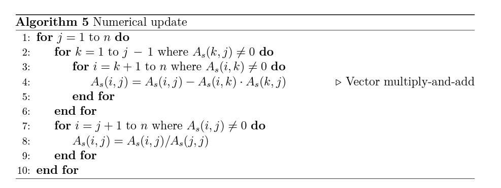
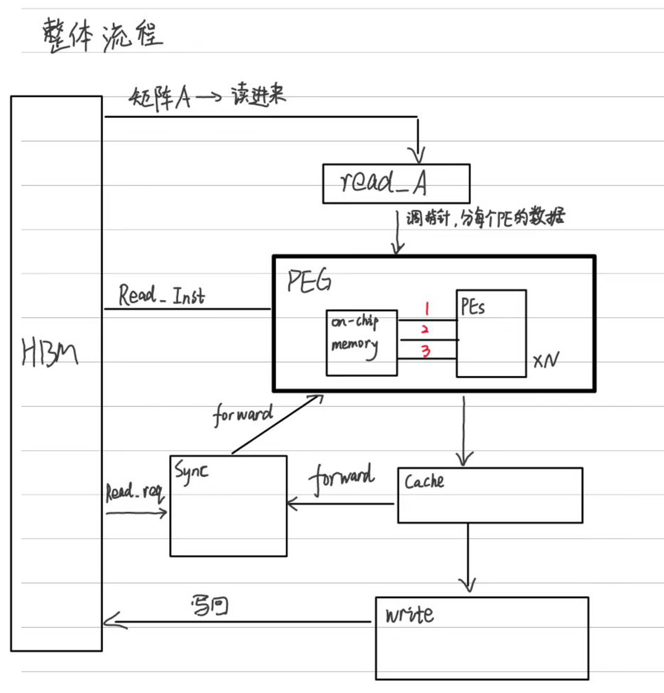

### 无同步稀疏LU基本知识

- LU分解基本计算步骤
  - step1： 对整个矩阵做减法乘法
  - step2： 对L的数据做除法

- 无同步思想：
  - 核心：可以用空间换时间
    - 在GPU上用到大量的Global Memory，在依赖的数据都处理完之后“第一时间”开始计算
    - 使用shared memory规避全局内存访问中较多的访存代价

### 具体实现
- 预处理
  - 使用AMD算法
  - 使用MC64算法
  
- 符号分解
  - 在CPU上进行，处理好的矩阵再给FPGA进行数值分解

- 数值分解

### 目前想法
- 整体流程：  
  首先在CPU上进行预处理，符号分解，处理好的矩阵再给FPGA进行数值分解  
  选择一些小的矩阵，保证U280一张卡的内存足够容纳。
  

- 块和块之间的依赖关系：  
  每个块依赖于它左边的和上边的所有的块。块也是稀疏的（全是非零块）

- HBM Channel应该可以把分好的块一起传进FPGA内。同时进行计算  
  需要确定U280这张卡可以实现多少PE核

- LU调用最频繁的kernel是SpGemm  
  这里可以仿照LevelST里面的Spmv用法来实现

- 分块的LU分解需要四种算子：小块的LU分解，上三角解，下三角解，矩阵乘法   
  块内主要优化SpGemm，块和块之间需要依赖关系

- 我们需要设计一种新的结构：  
  PE处理单元 + On-Chip Memory组成的PEGs  
  由于依赖左边的块 + 上边的块 + 读/写  
  所以目前考虑一个PE单元和三个on-chip memory组成一个大的处理单元（两个读，一个写）  

- 易达说他那边可以在最后验证正确性的步骤上，不需要对比CPU运行的LU的结果，可以通过对比原始矩数据，得知结果的正确性。
